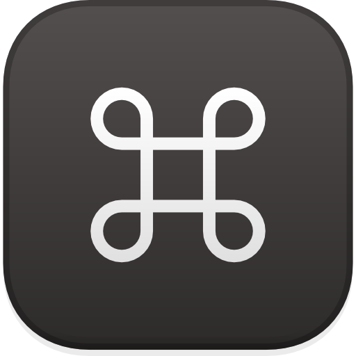

# AugustDev
### 💡 Software developer | Network student

**Sobre mí**

Soy desarrollador de software y estudiante de redes apasionado de la tecnología y la innovación. Me enfoco en crear soluciones digitales elegantes y minimalistas que inspiran, integrando la filosofía y la elegancia de Apple en mis aplicaciones. Mis sistemas operativos favoritos son **MacOS y Fedora (Linux)**.

 &nbsp; 

 

**⏳ hobbies**

Amante de la fotografía, la composición musical y la investigación de las últimas innovaciones en el ámbito de Apple y Fedora.

 &nbsp; &nbsp;  &nbsp; &nbsp; 
